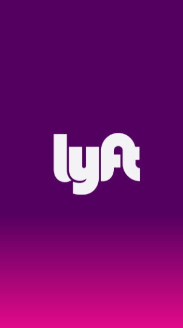
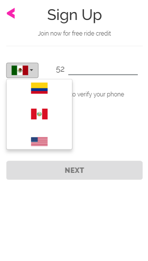
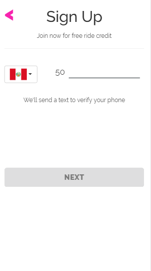
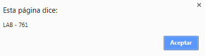
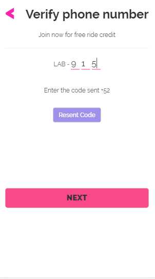
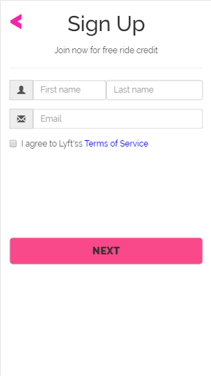
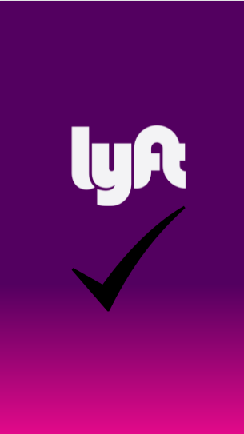

# LYFT

***

## Objetivos

Desarrolla una web-app que replique el sitio de Lyft, en este reto deberás cumplir los pasos necesarios para que tu usuario pueda registrarse.

## Flujo de la Aplicación

- Inicia con la vista de presentación.

  

- Se escoge la opción Sign Up.

  

- En esta vista se elige el pais y cambia el codigo postal, el boton se activara cuando ingrese un número de 9 digitos y mandara un codigo que se validara en la proxima vista.

   
   
   
   

- El boton se activa cuando el código anterior coincide , si no recuerda el código tiene una opción para volver a mandar un código aleatorio.

   

- En esta vista se presenta un formulario donde validara si los datos ingresados cumplen con ciertas condiciones.

    

- Si todo se realizo de forma correcta se mostrara esta vista.

   

## Desarrollado con

  `HTML5` `Jquery` `CSS3` `Bootstrap` 